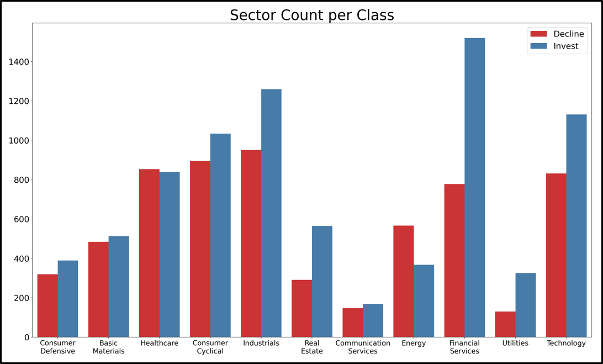
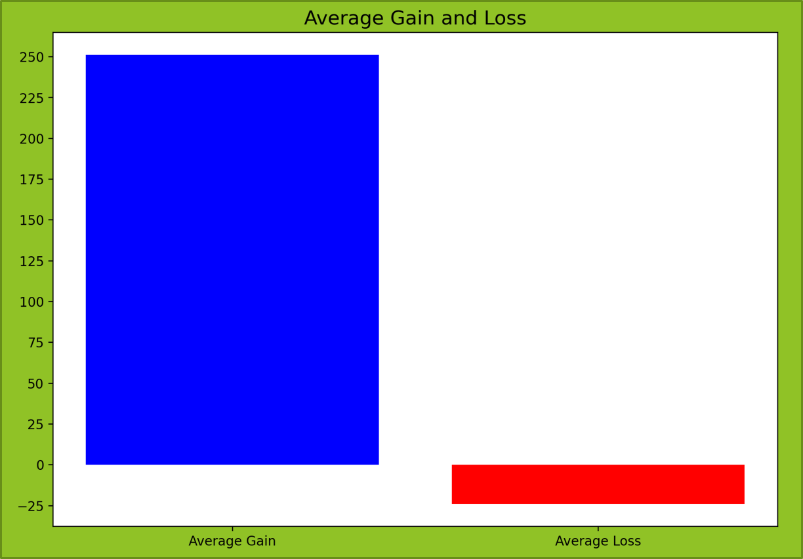
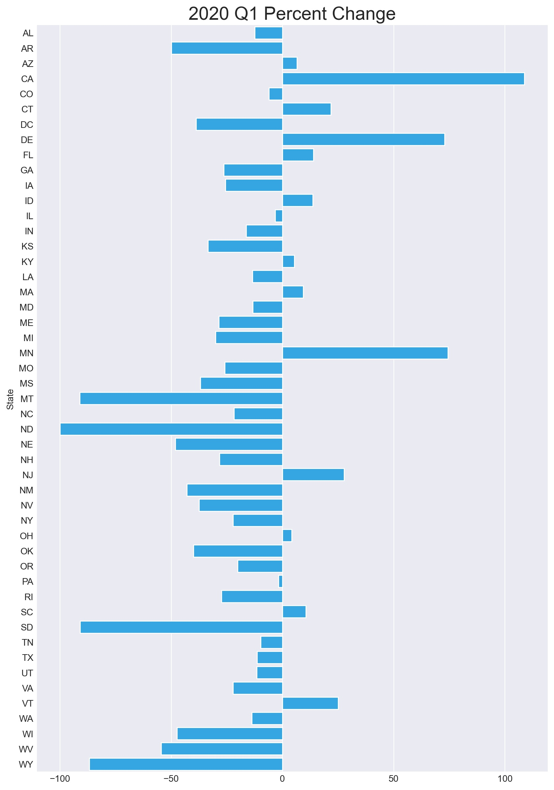
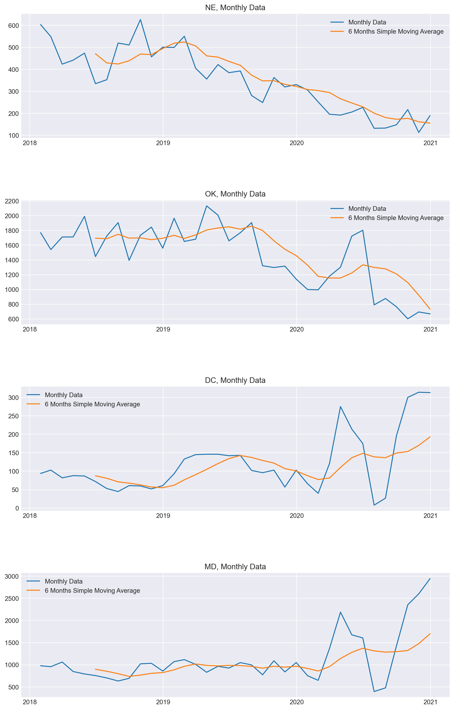

# Project 1
## [Stock Classification Based on Annual Financial Report](https://github.com/soccershowman/Springboard-Capstone/blob/master/README.md)

* Uploaded 5 different datasets and made necessary changes prior to merging.
* Merged datasets with appropriate indexing.
* Ensured data cleanliness by removing duplicate rows and columns.
* Engineered specific features to be used in the project.
* Analyzed data to understand its usefulness in the project.
* Created 4 different machine learning algorithms and decided on the best result.
* Made statistical analysis on the results of best algorithm.

 

# Project 2
## [U.S. Accident Forecast per State Time Series](https://github.com/soccershowman/Springboard/blob/master/Capstone_3/README.md)

* Uploaded a dataset with information about individual accidents.
* Selected the necessary columns and made date into datetime data type.
* Transformed each state into columns and counted the daily number of accidents in each one individually.
* Checked the data graphically for potential seasonality and/or trends.
* Acquire orders using AutoArima for the ARIMA model.
* Built individual ARIMA model for each states and saved them as dictionary to make it easier to find them while making each state their own individual model.
* Saved models results as a dataframe and analyzed them graphically.

 

