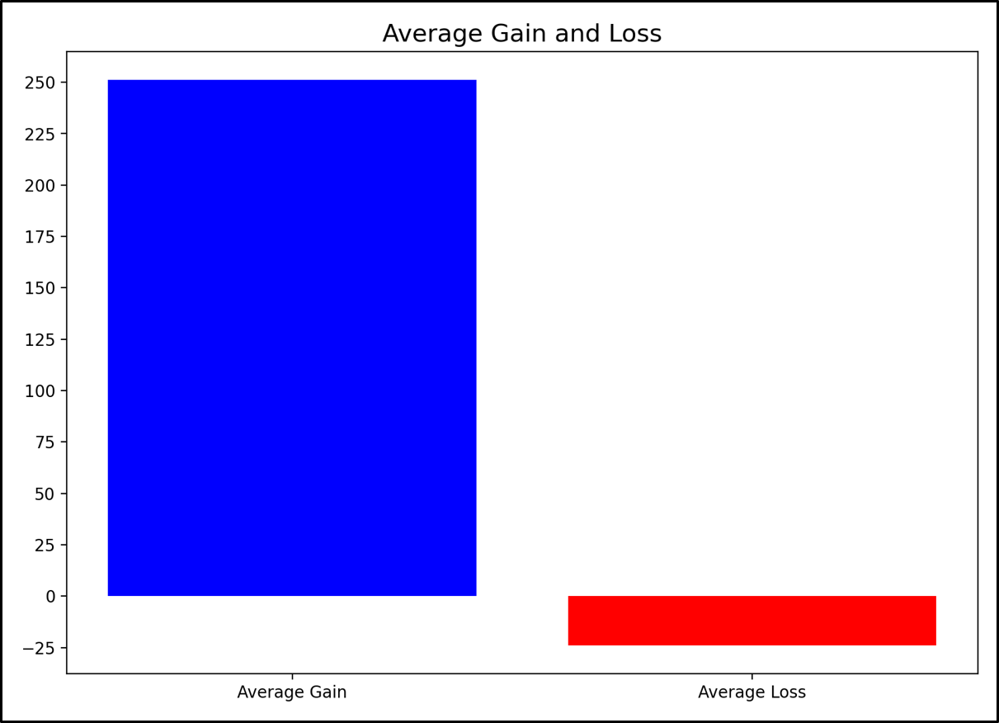

# Project 1
## [Stock Classification Based on Annual Financial Report](https://github.com/soccershowman/Springboard-Capstone/blob/master/README.md)

* Uploaded 5 different datasets and made necessary changes prior to merging.
* Merged datasets with appropriate indexing.
* Ensured data cleanliness by removing duplicate rows and columns.
* Engineered specific features to be used in the project.
* Analyzed data to understand its usefulness in the project.
* Created 4 different machine learning algorithms and decided on the best result.
* Made statistical analysis on the results of best algorithm.

 

